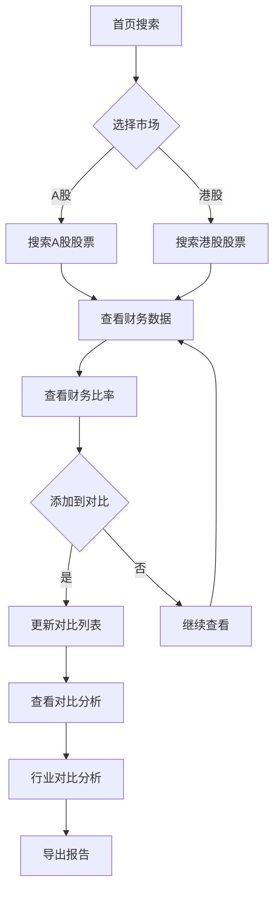

## 1. 产品概述
一款专业的A股和港股上市公司财务数据对比分析工具，帮助投资者快速获取、分析和对比不同市场上市公司的财务数据。
- 核心目的：提供便捷的财务数据查询和对比功能，辅助投资决策
- 目标用户：投资者、金融分析师、财务从业人员
- 市场价值：帮助用户在跨市场投资时快速了解不同上市公司的财务状况

## 2. 核心功能

### 2.1 用户角色
| 角色 | 注册方式 | 核心权限 |
|------|----------|----------|
| 普通用户 | 无需注册 | 浏览和使用基本查询功能 |

### 2.2 功能模块
1. **首页**：搜索框、热门股票、数据概览
2. **股票搜索**：A股/港股切换、代码/名称搜索、搜索历史
3. **财务数据展示**：资产负债表、利润表、现金流量表
4. **数据对比**：多股票对比、关键指标对比、图表可视化
5. **财务比率分析**：估值指标、盈利能力、偿债能力、运营能力
6. **数据导出**：Excel/PDF导出、自定义字段、对比报告
7. **收藏股票**：收藏列表、快速访问、数据更新提醒
8. **行业对比**：行业分类、同行业对比、行业平均参考线
9. **图表分析**：雷达图、K线图、杜邦分析、漏斗图
10. **数据筛选与排序**：按指标排序、行业筛选、自定义条件
11. **财务预警**：异常波动提醒、财务健康评分、风险提示
12. **历史数据回溯**：多历史年份、季度数据、同比/环比分析
13. **新闻资讯**：关联新闻、公告信息、市场热点
14. **财务日历**：财报发布提醒、重要事件标记

### 2.3 页面详情
| 页面名称 | 模块名称 | 功能描述 |
|----------|----------|----------|
| 首页 | 搜索区域 | 支持A股/港股切换，输入股票代码或名称搜索 |
| 首页 | 热门股票 | 展示热门A股和港股列表，点击快速查看 |
| 首页 | 数据概览 | 展示选中股票的核心财务指标概览卡片 |
| 财务数据 | 资产负债表 | 展示最新季度和年度资产负债数据 |
| 财务数据 | 利润表 | 展示最新季度和年度利润数据 |
| 财务数据 | 现金流量表 | 展示最新季度和年度现金流量数据 |
| 财务比率 | 估值指标 | PE、PB、PS等估值指标计算与展示 |
| 财务比率 | 盈利能力 | ROE、ROA等盈利能力指标 |
| 财务比率 | 偿债能力 | 资产负债率、流动比率、速动比率 |
| 财务比率 | 运营能力 | 应收账款周转率、存货周转率 |
| 数据对比 | 对比列表 | 管理要对比的股票列表，支持添加/删除 |
| 数据对比 | 指标对比 | 以表格形式对比各股票的关键财务指标 |
| 数据对比 | 图表展示 | 以柱状图、折线图、雷达图形式可视化对比数据 |
| 行业对比 | 行业分类 | 按行业分类展示股票 |
| 行业对比 | 行业对比 | 同行业财务数据对比，行业平均参考线 |
| 历史数据 | 年度数据 | 多历史年份数据展示 |
| 历史数据 | 季度数据 | 季度数据展示，同比/环比分析 |
| 新闻资讯 | 股票新闻 | 关联股票的新闻资讯 |
| 新闻资讯 | 公告信息 | 公司公告信息展示 |
| 财务日历 | 日历视图 | 财报发布日期提醒，重要事件标记 |
| 收藏 | 收藏列表 | 用户收藏的股票列表 |
| 导出 | 数据导出 | Excel/PDF格式导出，自定义字段 |
| 预警 | 风险提示 | 财务健康评分，异常波动提醒 |

## 3. 核心流程

用户搜索股票 → 查看财务数据 → 添加到对比列表 → 生成对比分析 → 导出报告

## 4. 用户界面设计

### 4.1 设计风格
- 主色调：深蓝色系（专业金融风格），配合绿色（增长）和红色（下降）
- 按钮样式：圆角矩形，渐变背景
- 字体：使用专业金融类字体，标题使用粗体，正文使用常规字体
- 布局：卡片式布局，清晰的信息层级
- 图标：简洁的线性图标

### 4.2 页面设计概述
| 页面名称 | 模块名称 | UI元素 |
|----------|----------|--------|
| 首页 | 搜索区域 | 市场切换Tab、搜索输入框、搜索按钮 |
| 首页 | 热门股票 | 横向滚动列表、股票卡片、涨跌幅指示器 |
| 首页 | 数据概览 | 财务指标卡片网格、数值和变化率 |
| 财务数据 | 表格区域 | 可切换的财务报表Tab、数据表格 |
| 财务比率 | 指标卡片 | 各类财务比率的可视化卡片 |
| 数据对比 | 对比列表 | 股票标签、删除按钮、清空按钮 |
| 数据对比 | 图表区域 | 图表类型切换、交互式图表 |
| 行业对比 | 行业筛选 | 行业分类选择、行业平均参考线 |
| 历史数据 | 时间筛选 | 年度/季度切换、同比/环比展示 |
| 新闻资讯 | 新闻列表 | 新闻卡片、时间排序 |
| 财务日历 | 日历视图 | 月份切换、事件标记 |
| 收藏 | 收藏列表 | 收藏卡片、快速操作 |

### 4.3 响应式设计
- 桌面优先设计
- 大屏幕：三列布局，充分展示数据
- 中等屏幕：两列布局
- 小屏幕：单列布局，横向滚动表格

### 4.4 交互设计
- 搜索时实时提示匹配结果
- 表格支持排序
- 图表支持悬停查看详情
- 添加对比时动画反馈
- 收藏功能本地存储持久化
- 财务预警实时提示
