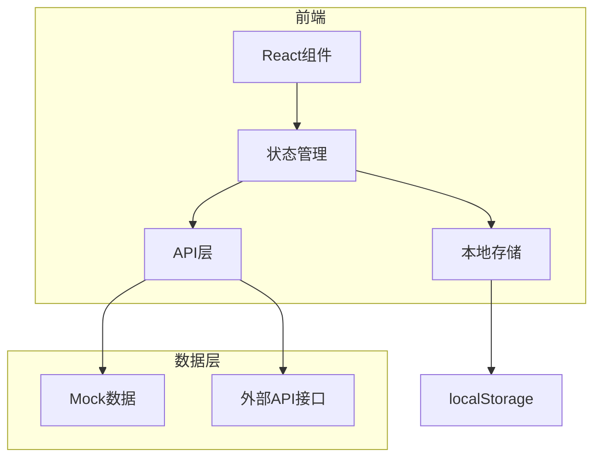
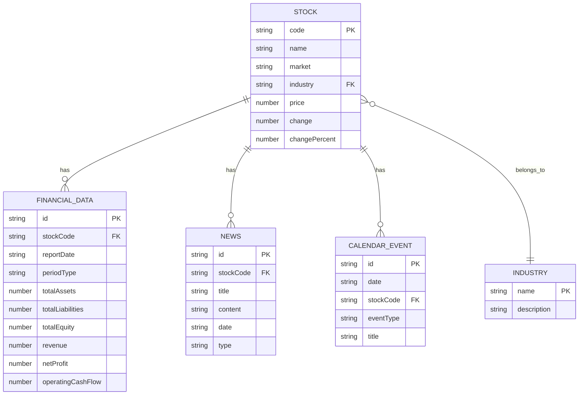

## 1. 架构设计



## 2. 技术描述
- 前端：React@18 + TypeScript + TailwindCSS@3 + Vite
- 状态管理：Zustand（含localStorage持久化）
- 图表库：Recharts（基础图表）、lightweight-charts（K线图）
- 路由：React Router v6
- 导出功能：xlsx（Excel）、jspdf（PDF）
- 数据：Mock数据（16只股票，3年年度+季度财务数据）

## 3. 路由定义
| 路由 | 用途 |
|------|------|
| / | 首页，搜索和数据概览 |
| /compare | 数据对比页面 |
| /favorites | 收藏列表页面 |
| /calendar | 财务日历页面 |
| /news | 新闻资讯页面 |

## 4. API定义

### 4.1 股票搜索API
```typescript
interface Stock {
  code: string;
  name: string;
  market: 'a股' | '港股';
  industry: string;
  price: number;
  change: number;
  changePercent: number;
}

// 搜索股票
GET /api/stocks?keyword=xxx&market=a股&industry=xxx
返回: { data: Stock[] }
```

### 4.2 财务数据API
```typescript
interface FinancialData {
  stockCode: string;
  stockName: string;
  market: 'a股' | '港股';
  reportDate: string;
  periodType: 'annual' | 'quarter';
  balanceSheet: {
    totalAssets: number;
    totalLiabilities: number;
    totalEquity: number;
    currentAssets: number;
    currentLiabilities: number;
    nonCurrentAssets: number;
    nonCurrentLiabilities: number;
    inventory: number;
    accountsReceivable: number;
  };
  incomeStatement: {
    revenue: number;
    grossProfit: number;
    netProfit: number;
    operatingProfit: number;
    eps: number;
    grossMargin: number;
    netMargin: number;
  };
  cashFlow: {
    operatingCashFlow: number;
    investingCashFlow: number;
    financingCashFlow: number;
    netCashFlow: number;
  };
  ratios: {
    pe: number;
    pb: number;
    ps: number;
    roe: number;
    roa: number;
    debtRatio: number;
    currentRatio: number;
    quickRatio: number;
    arTurnover: number;
    inventoryTurnover: number;
  };
}

// 获取财务数据
GET /api/financial/{stockCode}?market=a股&periodType=annual
返回: { data: FinancialData[] }

// 获取财务比率
GET /api/ratios/{stockCode}?market=a股
返回: { data: FinancialRatios }
```

### 4.3 行业数据API
```typescript
interface IndustryData {
  name: string;
  stocks: Stock[];
  averages: {
    pe: number;
    pb: number;
    roe: number;
    debtRatio: number;
  };
}

// 获取行业数据
GET /api/industry?market=a股
返回: { data: IndustryData[] }
```

### 4.4 新闻资讯API
```typescript
interface News {
  id: string;
  stockCode: string;
  title: string;
  content: string;
  date: string;
  type: 'news' | 'announcement';
}

// 获取股票新闻
GET /api/news/{stockCode}
返回: { data: News[] }
```

### 4.5 财务日历API
```typescript
interface CalendarEvent {
  id: string;
  date: string;
  stockCode: string;
  stockName: string;
  eventType: 'earnings' | 'dividend' | 'meeting';
  title: string;
}

// 获取财务日历
GET /api/calendar?month=2024-03
返回: { data: CalendarEvent[] }
```

## 5. 数据模型

### 5.1 数据模型定义


## 6. 项目结构
```
src/
├── components/
│   ├── Search/
│   ├── StockCard/
│   ├── FinancialOverview/
│   ├── FinancialTable/
│   ├── FinancialRatios/
│   ├── CompareList/
│   ├── Charts/
│   │   ├── RadarChart.tsx
│   │   ├── KLineChart.tsx
│   │   ├── DuPontChart.tsx
│   │   └── FunnelChart.tsx
│   ├── Industry/
│   ├── News/
│   ├── Calendar/
│   └── Export/
├── pages/
│   ├── HomePage/
│   ├── ComparePage/
│   ├── FavoritesPage/
│   ├── CalendarPage/
│   └── NewsPage/
├── store/
│   ├── useCompareStore.ts
│   └── useFavoritesStore.ts
├── api/
│   └── index.ts
├── data/
│   └── mockData.ts
├── types/
│   └── index.ts
├── utils/
│   ├── ratios.ts
│   ├── export.ts
│   └── analysis.ts
├── App.tsx
└── main.tsx
```

## 7. 新依赖清单
| 依赖名称 | 版本 | 用途 |
|----------|------|------|
| xlsx | ^0.18.5 | Excel导出 |
| jspdf | ^2.5.1 | PDF导出 |
| lightweight-charts | ^4.1.3 | K线图 |
| lucide-react | ^0.511.0 | 图标 |
| zustand | ^5.0.3 | 状态管理 |
