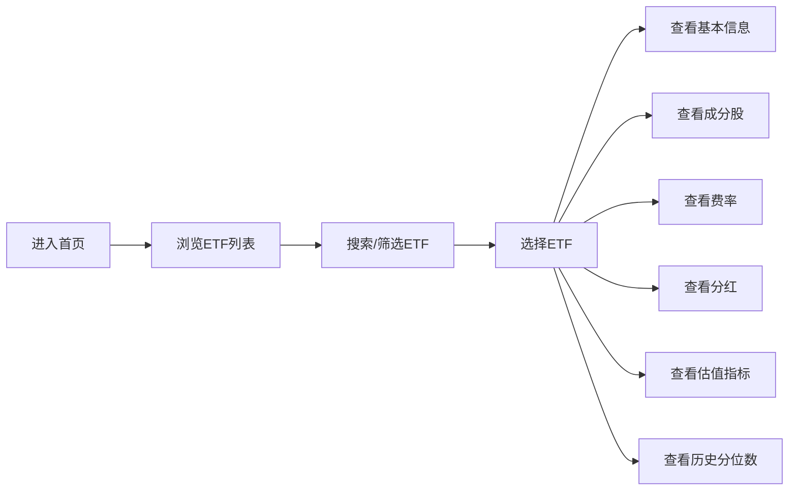

# 中国股市ETF查询工具 - 产品需求文档

## 1. Product Overview

中国股市ETF查询工具是一款面向投资者的专业金融数据查询应用，提供ETF列表浏览、详情查看、估值分析等功能，帮助用户快速了解各类ETF的投资价值。

- **主要用途**: 为投资者提供便捷的ETF信息查询服务
- **解决问题**: 投资者难以快速获取全面的ETF数据，包括成分股、费率、估值等关键信息
- **目标用户**: 个人投资者、金融从业者、投资研究人员
- **市场价值**: 帮助投资者做出更明智的投资决策，提升投资效率

## 2. Core Features

### 2.1 User Roles

| Role | Registration Method | Core Permissions |
|------|---------------------|------------------|
| Normal User | 无需注册 | 浏览ETF列表、查看ETF详情 |
| Admin | 后台管理 | 管理ETF数据（后续扩展） |

### 2.2 Feature Module

1. **ETF列表页**: ETF分类筛选、搜索、列表展示、快速筛选
2. **ETF详情页**: 基本信息、成分股、费率、分红、估值指标、历史分位数

### 2.3 Page Details

| Page Name | Module Name | Feature description |
|-----------|-------------|---------------------|
| ETF列表页 | 搜索框 | 支持ETF代码、名称搜索 |
| ETF列表页 | 筛选器 | 按类型（宽基/行业/主题/债券/跨境）筛选 |
| ETF列表页 | ETF卡片 | 展示代码、名称、规模、跟踪指数、近一年收益 |
| ETF详情页 | 基本信息 | 代码、名称、基金公司、成立日期、规模、跟踪指数 |
| ETF详情页 | 成分股 | 前十大重仓股、持仓比例、涨跌幅 |
| ETF详情页 | 费率信息 | 管理费、托管费、销售服务费、申购赎回费 |
| ETF详情页 | 分红情况 | 分红记录、分红金额、除息日 |
| ETF详情页 | 估值指标 | 当前PE、PB、PS等估值指标 |
| ETF详情页 | 历史分位数 | PE/PB历史分位（近3年/5年）、走势图 |

## 3. Core Process

用户进入首页 → 浏览或搜索ETF列表 → 选择感兴趣的ETF → 查看ETF详情（基本信息、成分股、费率、分红、估值）

## 4. User Interface Design

### 4.1 Design Style

- **主色调**: 深蓝色系(#1e3a5f)作为主色，象征金融专业与稳重
- **辅助色**: 绿色(#10b981)表示上涨，红色(#ef4444)表示下跌，橙色(#f59e0b)作为强调色
- **按钮风格**: 圆角矩形，主按钮采用深蓝色背景白色文字，悬停有阴影效果
- **字体**: 采用Inter字体，数字使用等宽字体
- **布局风格**: 卡片式布局，清晰的信息层级，响应式设计
- **图标风格**: 使用lucide-react图标库，简洁现代

### 4.2 Page Design Overview

| Page Name | Module Name | UI Elements |
|-----------|-------------|-------------|
| ETF列表页 | 顶部导航 | Logo、搜索框、筛选按钮 |
| ETF列表页 | 筛选器 | 标签式筛选（宽基/行业/主题等） |
| ETF列表页 | ETF列表 | 卡片列表，展示代码、名称、规模、收益 |
| ETF详情页 | 头部信息 | ETF名称、代码、跟踪指数、实时净值 |
| ETF详情页 | 标签页切换 | 基本信息、成分股、费率、分红、估值、分位数 |
| ETF详情页 | 数据表格 | 成分股表格、费率表格、分红表格 |
| ETF详情页 | 图表区域 | PE/PB历史分位数走势图 |

### 4.3 Responsiveness

- **桌面端**: 完整功能展示，多列布局
- **平板端**: 自适应两列布局
- **移动端**: 单列布局，折叠式菜单，触控优化

### 4.4 3D Scene Guidance

不适用此项目