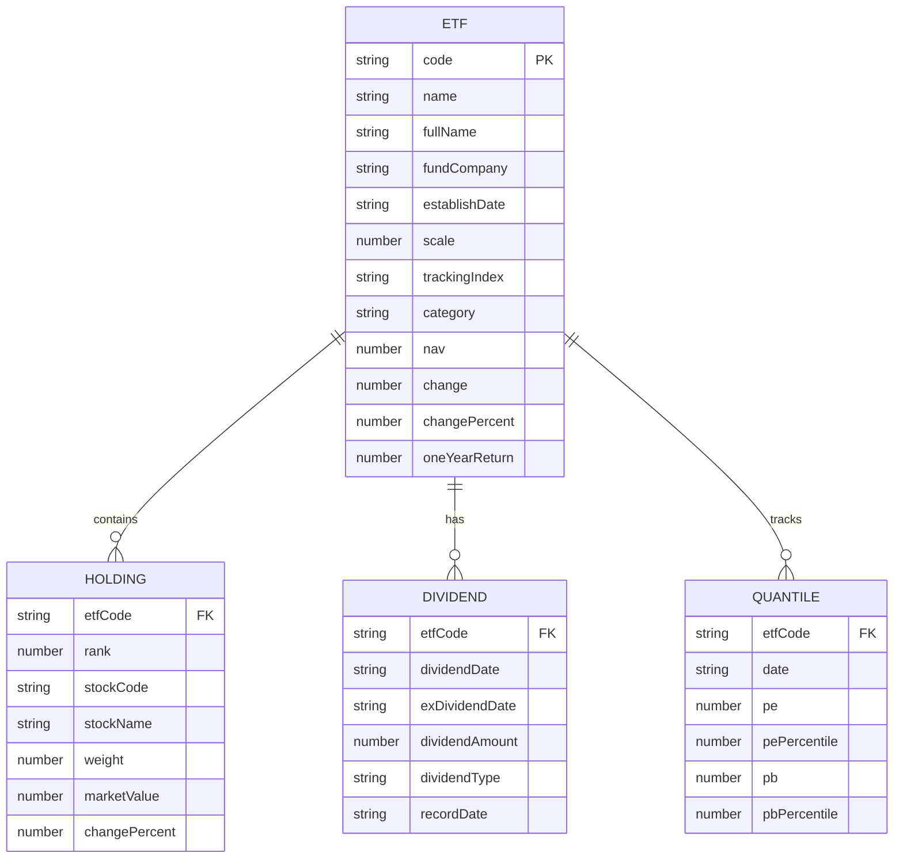

# 中国股市ETF查询工具 - 技术架构文档

## 1. Architecture Design

```mermaid
flowchart LR
    subgraph Frontend
        A[React + TypeScript] --> B[Tailwind CSS]
        A --> C[React Router]
        A --> D[Zustand]
        A --> E[Chart.js]
    end
    
    subgraph Data Layer
        F[Mock API] --> G[ETF数据]
        F --> H[成分股数据]
        F --> I[估值数据]
    end
    
    Frontend --> Data Layer
```

## 2. Technology Description

- **Frontend**: React@18 + TypeScript + Tailwind CSS@3
- **Build Tool**: Vite@6
- **Routing**: React Router@6
- **State Management**: Zustand
- **Charting**: Chart.js + react-chartjs-2
- **Icons**: Lucide React
- **Backend**: 无（使用Mock数据）
- **Database**: 无（使用JSON Mock数据）

## 3. Route Definitions

| Route | Purpose | Component |
|-------|---------|-----------|
| / | ETF列表页 | ETFListPage |
| /etf/:code | ETF详情页 | ETFDetailPage |

## 4. API Definitions

### 4.1 ETF列表API

**GET /api/etfs**

| Parameter | Type | Description |
|-----------|------|-------------|
| type | string | 可选，ETF类型筛选 |
| keyword | string | 可选，搜索关键词 |

**Response**:
```typescript
interface ETFListResponse {
  etfs: ETF[];
  total: number;
}

interface ETF {
  code: string;
  name: string;
  fullName: string;
  fundCompany: string;
  establishDate: string;
  scale: number;
  trackingIndex: string;
  category: 'broad' | 'industry' | 'theme' | 'bond' | 'cross-border';
  categoryName: string;
  nav: number;
  change: number;
  changePercent: number;
  oneYearReturn: number;
  pe: number;
  pb: number;
}
```

### 4.2 ETF详情API

**GET /api/etfs/:code**

**Response**:
```typescript
interface ETFDetailResponse {
  basic: ETFBasicInfo;
  holdings: ETFHolding[];
  fees: ETFFees;
  dividends: ETFDividend[];
  valuation: ETFValuation;
  quantiles: ETFQuantile[];
}

interface ETFBasicInfo {
  code: string;
  name: string;
  fullName: string;
  fundCompany: string;
  establishDate: string;
  latestReportDate: string;
  scale: number;
  scaleDate: string;
  trackingIndex: string;
  indexCode: string;
  creationDate: string;
  managementFeeRate: number;
  custodianFeeRate: number;
  salesServiceFeeRate: number;
}

interface ETFHolding {
  rank: number;
  stockCode: string;
  stockName: string;
  weight: number;
  marketValue: number;
  changePercent: number;
}

interface ETFFees {
  managementFee: number;
  custodianFee: number;
  salesServiceFee: number;
  subscriptionFee: number;
  redemptionFee: number;
  managementFeeRate: string;
  custodianFeeRate: string;
  salesServiceFeeRate: string;
}

interface ETFDividend {
  dividendDate: string;
  exDividendDate: string;
  dividendAmount: number;
  dividendType: string;
  recordDate: string;
}

interface ETFValuation {
  pe: number;
  pePercentile: number;
  pb: number;
  pbPercentile: number;
  ps: number;
  psPercentile: number;
  earningsYield: number;
  dividendYield: number;
}

interface ETFQuantile {
  date: string;
  pe: number;
  pePercentile: number;
  pb: number;
  pbPercentile: number;
}
```

## 5. Server Architecture Diagram

不适用（前端Mock数据）

## 6. Data Model

### 6.1 Data Model Definition



### 6.2 Data Definition Language

使用JSON Mock数据文件存储，无需数据库DDL。

### 6.3 Mock数据文件结构

```
src/data/
├── etfs.json          # ETF列表数据
├── etf-details/       # ETF详情数据
│   ├── 510050.json    # 具体ETF详情
│   ├── 510300.json
│   └── ...
└── quantiles/         # 历史分位数数据
    ├── 510050.json
    └── ...
```

## 7. Project Structure

```
.
├── .trae/
│   └── documents/
│       ├── prd.md
│       └── tech-arch.md
├── src/
│   ├── components/
│   │   ├── ETFCard.tsx          # ETF卡片组件
│   │   ├── ETFList.tsx          # ETF列表组件
│   │   ├── ETFHeader.tsx        # ETF详情头部
│   │   ├── BasicInfo.tsx        # 基本信息组件
│   │   ├── Holdings.tsx         # 成分股组件
│   │   ├── Fees.tsx             # 费率组件
│   │   ├── Dividends.tsx        # 分红组件
│   │   ├── Valuation.tsx        # 估值组件
│   │   ├── QuantileChart.tsx    # 分位数图表
│   │   └── Header.tsx           # 顶部导航
│   ├── pages/
│   │   ├── ETFListPage.tsx      # ETF列表页
│   │   └── ETFDetailPage.tsx    # ETF详情页
│   ├── data/
│   │   ├── etfs.json
│   │   └── etf-details/
│   ├── api/
│   │   └── etf.ts               # API调用
│   ├── types/
│   │   └── index.ts             # 类型定义
│   ├── hooks/
│   │   └── useETF.ts            # ETF数据hook
│   ├── App.tsx
│   ├── main.tsx
│   └── index.css
├── package.json
├── vite.config.ts
├── tsconfig.json
├── tailwind.config.js
└── README.md
```

## 8. 第三方依赖

| 依赖 | 版本 | 用途 |
|------|------|------|
| react | ^18.2.0 | 前端框架 |
| react-dom | ^18.2.0 | DOM渲染 |
| react-router-dom | ^6.8.0 | 路由管理 |
| zustand | ^4.3.0 | 状态管理 |
| tailwindcss | ^3.2.0 | CSS框架 |
| chart.js | ^4.2.0 | 图表库 |
| react-chartjs-2 | ^5.2.0 | React图表组件 |
| lucide-react | ^0.263.0 | 图标库 |
| @types/node | ^18.11.0 | TypeScript类型 |

## 9. 开发环境

- Node.js: >= 18.0.0
- npm/pnpm: 最新稳定版
- Vite: 6.x

## 10. 部署方案

- 开发环境: `npm run dev`
- 生产构建: `npm run build`
- 静态部署: 将build产物部署到任何静态服务器